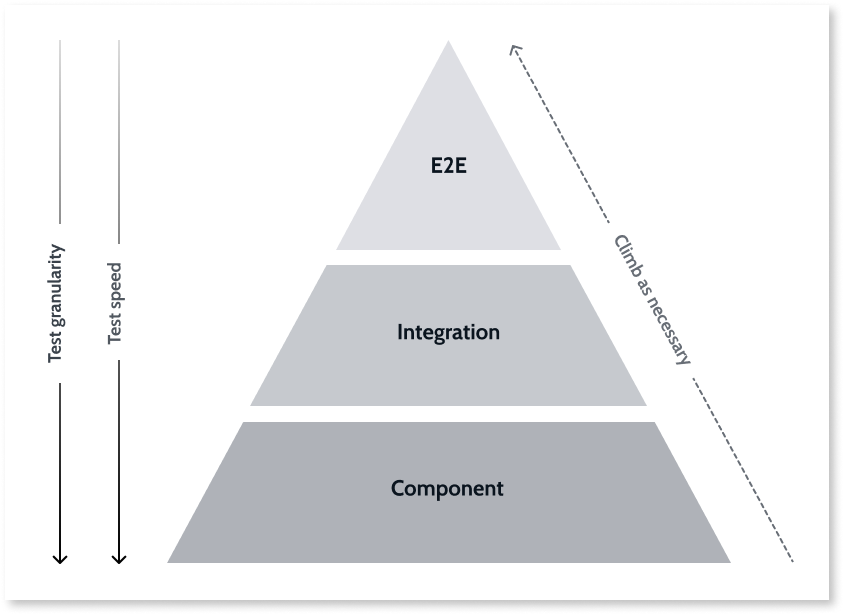

# Application Lifecycle Management in OutSystems CI/CD

## The CI/CD continuous delivery pipeline

* Development (DEV): primary development environment
* Regression (REG): regression test environment
* Acceptance (ACC): environment for manual exploratory testing. Promotion to the two environments in the automatic deployment lane requires manual approval.
* Pre-Production (PRE): a dry-run environment to rehearse deployment in a production-like environment. If no problems are detected the release candidate is automatically promoted.
* Production (PRD): Ready for release

## Continuous integration

* Service Studio TrueChange
* Trunk-based development model

### Component tests - BDD

* BDDFramework (for server-side tests)
* BDDFramework Client Side (for client-side tests)

### Integration/API tests

* BDDFramework

### E2E tests

* Selenium

## Continuous delivery

* LifeTime
* OutSystems-pipeline python package

## Other tools

* Ghost Inspector
* Applitools
* Appium
* Azure Devops
* Browserstack
* Elastic
* Katalon
* SauceLabs
* Triscentis Tosca