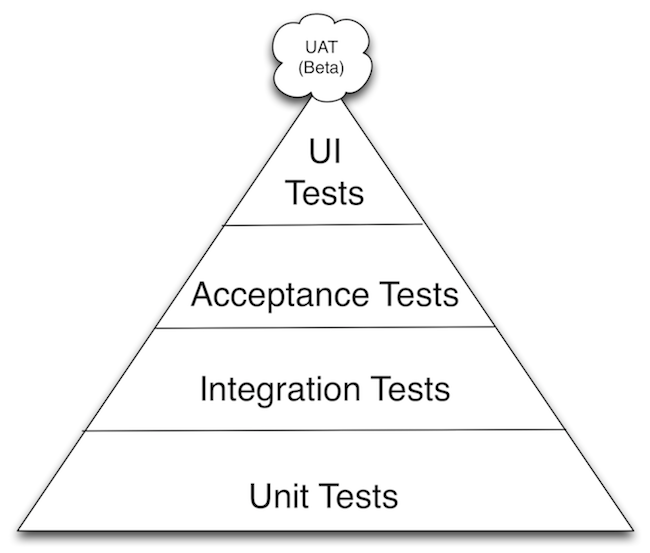
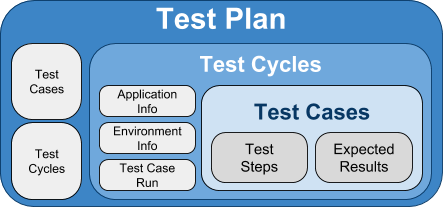

# How to Automate Unit Testing and API Testing

Test...
* strategy - define types and amount of testing
* plan - indicate tasks to implement strategy
* cases - detailed usage examples
* data - definition of input and existing production-like data
* environment - where application to be tested can be deployed and where testing cycles are carried out

Every test case has the following attributes:
* Title
* Understandable description
* Assumptions and/or pre-conditions
* A set of test steps
* Test data to be used to execute the functionality
* Expected result

Test Framework + BDD Framework

BDD - Given... When... Then

Trends:
* The higher the number of test steps that **pass**, the **more exhaustive** the test project.
* The higher the number of test steps **unclassified**, the higher the work that will be required from testers to classify executions: **“testing technical debt”**.
* The higher the number of test steps **broken**, the higher the work that is required to **fix tests** and **make them useful again**.
* The higher the number of test steps that **found defects**, the **lower the quality** of the application.