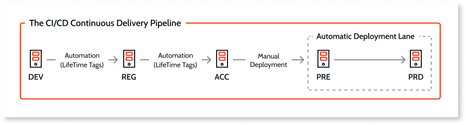

# OutSystems continuous delivery pipeline

## Development (DEV)

* primary environment for developing OutSystems applications

## Regression (REG)

* run automatic regression suite to assess deployability
* includes unit tests written with BDD Framework

## Acceptance (ACC)

* manual and exploratory testing of release candidate

## Pre-production (PRE) and Production (PRD)

* deployment of release candidate triggered by an authorized user using a "push-button" approach

BDD apps not promoted beyond Regression (REG)