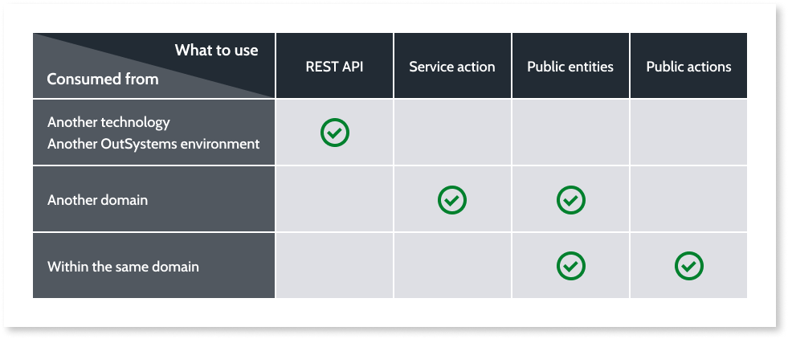

# Develop for Testability

## Anti-Pattern #1: Validations at the UI Level Only

* Move all business validations to the Core action.
* Core module action should be testable and take business validations/rules into account on its own.
* Should be possible to independently test for validation/rule tests, without depending on UI test.
* At the UI level, validations should focus more on user interaction, simple input validation feedback.

## Anti-Pattern #2: Business Logic at the UI Level

* Encapsulate the logic that needs to be tested in public action at Core module level, which will then be used in the screen action.

## Anti-Pattern #3: Unsupported Cross-Domain Referencing

* If entities are only referenced through APIs or Service Actions, use mock services to simulate data from the external domain.

## Anti-Pattern #4: Same API Consumed in Multiple Modules

* Isolate the API consumption in a wrapper module that exposes the API methods through public actions.

## UI simulation

* Ensure that all elements that have some degree of user interaction, such as inputs, buttons, and links, have the name property assigned with a meaningful value.
* If same name is used in two different Blocks for the same screen, name collision will not be automatically addressed by Service Studio.
* Recommend to include the block name as a prefix to the name of the UI widget.
* If multiple instances of the same block on the same screen, wrap each block in a container with a specific ID for the screen.
* XPath or CSS selectors.
* Extended property named "os-test-id".
* Drawbacks - development effort, no collission detection.

## Architecture Canvas

End User Layer

* Automater E2E UI Testing.

Core Layer

* Automated End-to-End Testing (non-UI)
* Automated API Testing
* Automated Unit/Component Testing

Library Layer

* Automated API Testing
* Automated Unit/Component Testing (non-business)