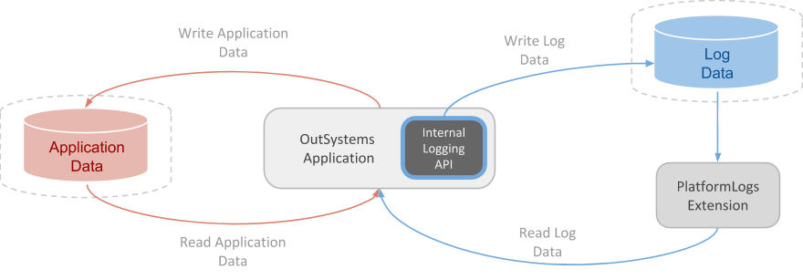

# Monitor and Troubleshoot

## Built-in Tools

### Service Center Console

* application logs and errors
* web and mobile requests
* integration calls
* business processes
* security audits
* current status of environment servers and services
* aggregation reports

### Lifetime Analytics

* Performance and end user experience of Tradition Web Apps
* identify bottlenecks at client, network and server level

### App Feedback

* feedback gathering
* defect tracking

## Extending OutSystems Monitoring Capabilities

* Asynchronous Logging API - custom logs
* Monitor Probe
* New Relic RUM
* Dynatrace RUM
* PerformanceMonitoring API - request events

## View the Environment Logs and Status

OutSystems Cloud retention period is always set to 9 weeks

* Error
* General
* Traditional Web Requests
* Screen Requests
* Service Actions
* Integrations
* Extensions
* Timers
* Emails
* Processes
* Mobile Apps
* Environment Health
* Security - Blocked IP due to multiple failed login attempts
* Native App Shell - DeviceModel, OperatingSystem, Cordova, DeviceUUID, NetworkType, NativeShell, NetworkStatus
* Deployment Controller Service - compiling and coordinating deployment, only 1
* Scheduler service - async processes, at least 1
* Deployment Service - ensure published application is deployed, every FE server
* Server.API - expose platform functionality, every FE server with Service Center, IIS
* Server.Identity - authenticate users and access control, every FE server with Server.API, IIS

## Monitor Usage with Audit Logs

The tasks IT users performed - Manage infra and users

All tasks performed to:
* Applications - List permission level for the specific application
* Deployment Plans - List permission level for the applications in deployment plan
* Users - Manage infra and users
* Teams - Manage Teams and Application Roles for the specific team
* Roles - Manage infra and users
* Environments
* Infrastructure - Manage infra and users

## Logging database and architecture

* separates logs by types into multiple tables
* rotates logic that enables retention
* asynchronous
* bulk writing
* store log in separate database
* each application writes own log entries using internal logging API
* internal logging API sends to log database

* Deployment Controller writes directly to tables
* Service Center consults views
* Service Studio > PlatformLogs Extension

## The log tables and views

* set of 10 tables
* 2 views - current week, previous week
* top-level - Screen, Integration, Mobile Request, Cyclic Job
* drill - Error, General, Integration, Extension
* top-level mapped to drill via request_key
* rotation - every Friday at 11h45 PM (database time)
* cycle number - Number of weeks between Jan 1st 2000 and today MOD 10
* rotation - define new views, log point to new tables, old log tables are cleaned after retention period

