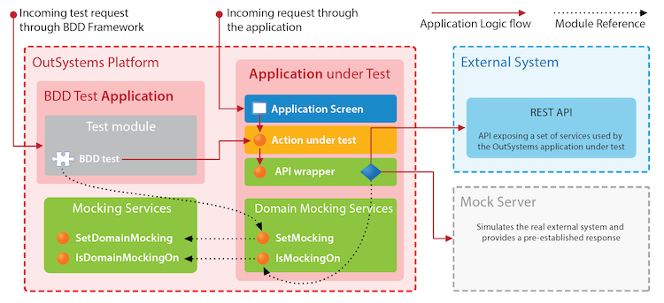
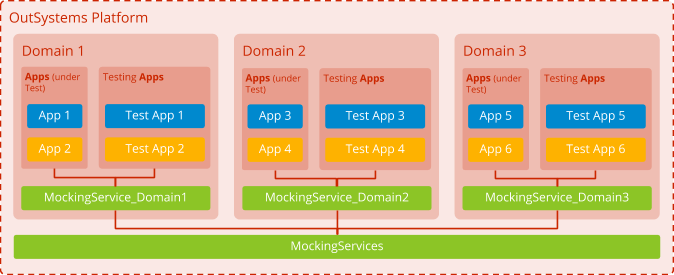

## Automated Testing Strategy

Application built with testability

* Apply Testing Pyramid principles.

Application not built with testabiltiy

* Refactor application and apply Testing Pyramid principles.
* Postpone refactoring and apply more tactical E2E-based test automation approach.

## Test Data Management

Possible data sources

* System Under Test (SUT) OutSystems application data
  * Common/System-wide/Master data
    * Implement specific setup logic to bootstrap baseline "realistic" test data
    * Provision PRD database clone (not recommended)
  * Test specific data
    * Implement setup/teardown logic for the test (or test suite)
    * Data should not remain in the system after test execution
* External system data (which may include external systems data or other loosely coupled OutSystems application data)
  * OutSystems application mocking services
  * External systems mocking services

## Mocking Services Module

* MockingServerBaseURL
* MockingServicesOn
* DomainMocking - Persists the status of the mocking service for a specific domain
* SetDomainMocking
* IsDomainMockingOn

## DomainMockingServices Module

* DomainName
* IsMockingServicesOn - calls IsDomainMockingOn
* SetMockingServicesOn - calls SetDomainMocking
* SetMockingServicesOff - calls SetDomainMocking